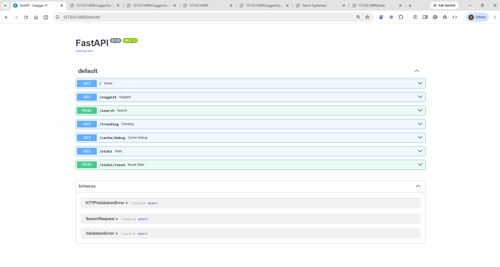
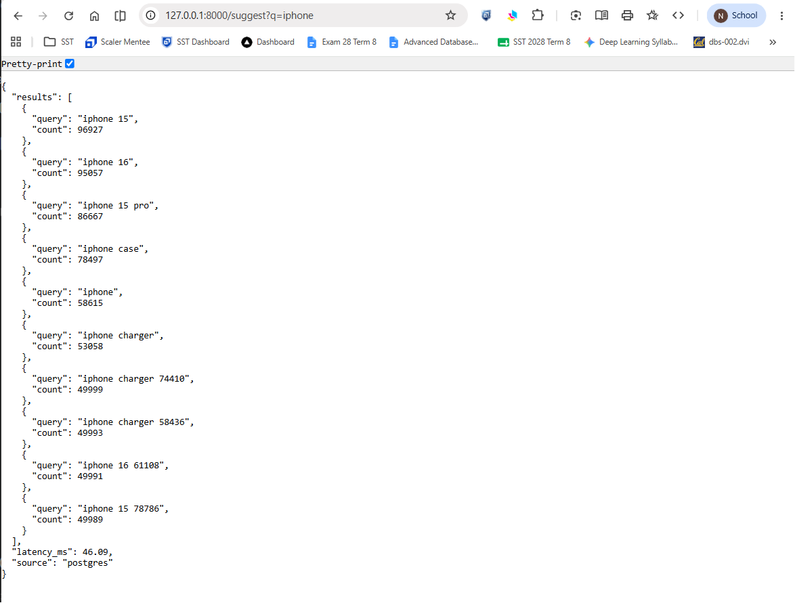
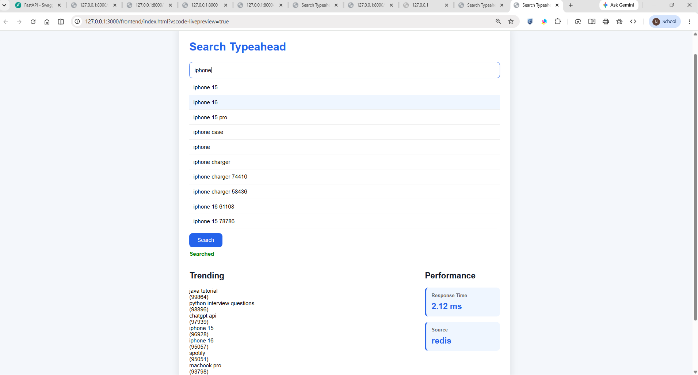
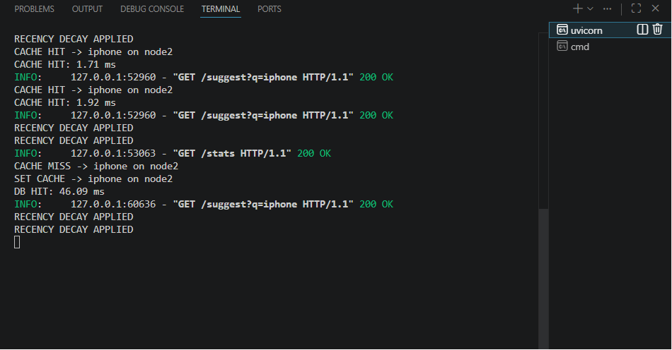
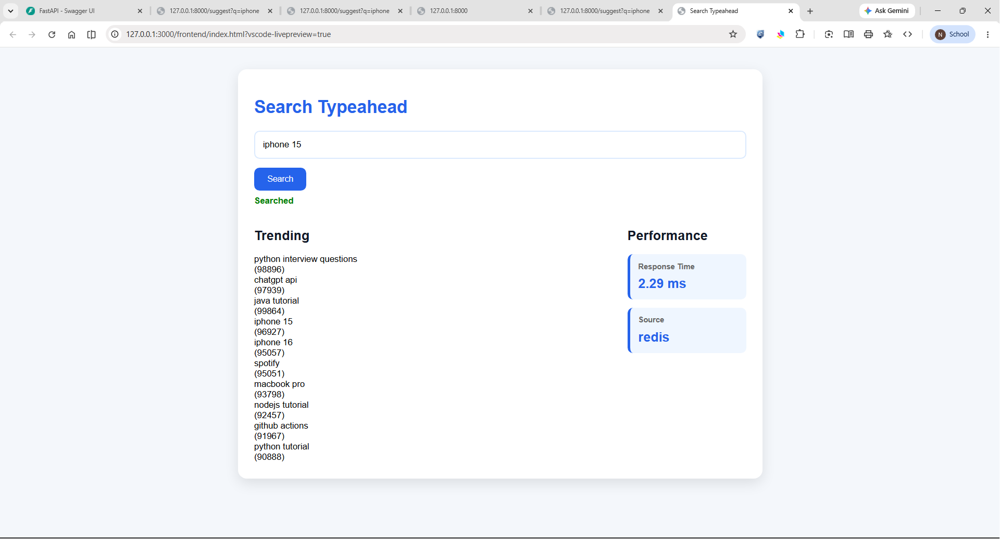
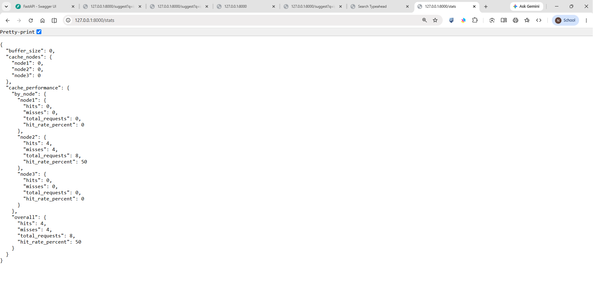
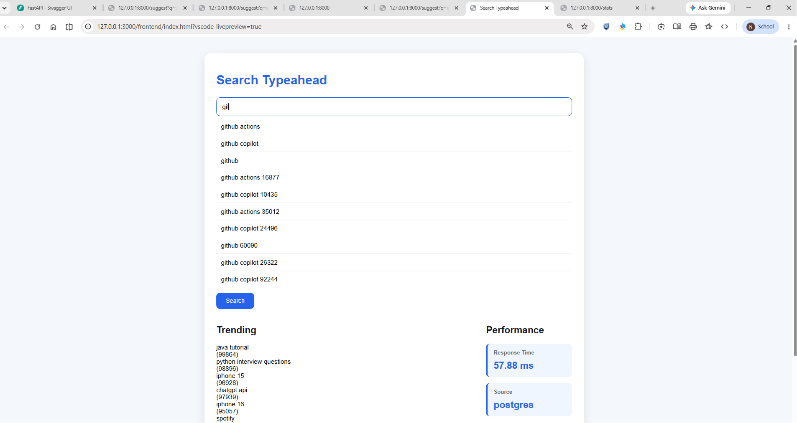

# Search Typeahead System

A Search Typeahead System built using FastAPI, PostgreSQL, and Redis. The system provides real-time search suggestions, supports search submissions, tracks query popularity, serves trending searches, and uses distributed caching with consistent hashing to achieve low-latency reads.

---

## Dataset

Dataset File:

```text
dataset/queries.csv
```

Total Records:

```text
100,001 queries
```

Format:

```csv
query,count

iphone,58615
iphone 15,96927
spotify,95051
java tutorial,99864
```

---

## Architecture

```text
Frontend (HTML/CSS/JS)
          │
          ▼
     FastAPI Backend
          │
    ┌─────┼─────┐
    ▼     ▼     ▼
 Redis1 Redis2 Redis3
    │     │     │
    └── Consistent Hashing ──┘
              │
              ▼
        PostgreSQL
              ▲
              │
       Batch Writer
```

---

## Design Choices

### Data Storage

- PostgreSQL stores query counts and trending scores.
- Query data is persisted for reliable retrieval and updates.

### Distributed Cache

- Three Redis cache nodes are used.
- Prefix ownership is determined using MD5-based hashing.

Example:

```text
iphone  -> node2
python  -> node3
macbook -> node3
```

### Cache Expiry

- Suggestions are cached with TTL.
- Expired entries are automatically refreshed from PostgreSQL.

### Trending Searches

Trending score:

```text
score = count + recent_score
```

Recent activity is tracked using:

```text
recent_score += count * 10
```

Decay Worker:

```text
recent_score = recent_score * 0.95
```

Runs every 60 seconds to prevent temporary spikes from dominating rankings.

### Batch Writes

Search submissions are buffered in memory.

Instead of:

```text
100 searches = 100 DB writes
```

the system performs:

```text
100 searches = 1 aggregated DB write
```

Trade-off:

```text
If the application crashes before a flush, buffered updates may be lost.
```

---

## API Documentation

### GET /suggest?q=<prefix>

Returns up to 10 suggestions matching the prefix.

Example:

```http
GET /suggest?q=iphone
```

Response:

```json
{
  "results": [
    {
      "query": "iphone 15",
      "count": 96927
    }
  ],
  "latency_ms": 26.19,
  "source": "postgres"
}
```

---

### POST /search

Records a search query.

Request:

```json
{
  "query":"spotify"
}
```

Response:

```json
{
  "message":"Searched"
}
```

---

### GET /cache/debug?prefix=<prefix>

Displays cache routing information.

Example:

```json
{
  "prefix":"iphone",
  "node":"node2",
  "hit":true
}
```

---

### GET /trending

Returns top trending searches.

---

## Performance Report

### Measured Latency

| Operation | Latency |
|------------|----------|
| PostgreSQL Read | 30.95 ms |
| Redis Cache Hit | 0.99 ms |

Observed Improvement:

```text
~31x faster using Redis cache
```

### Cache Hit Example

```text
CACHE MISS -> iphone on node2
SET CACHE -> iphone on node2
DB HIT: 30.95 ms
```

```text
CACHE HIT -> iphone on node2
CACHE HIT: 0.99 ms
```

### Consistent Hashing Evidence

```text
CACHE MISS -> iphone on node2
CACHE HIT -> iphone on node2

CACHE MISS -> python on node3
CACHE MISS -> macbook on node3
```

### Write Reduction

Observed Batch Flush:

```text
FLUSHING {'spotify': 20}
```

This demonstrates aggregation of repeated searches before database updates.

---

## Setup Instructions

### Start Infrastructure

```bash
docker compose up -d
```

### Install Dependencies

```bash
pip install -r requirements.txt
```

### Run Backend

```bash
uvicorn main:app --reload
```

Backend:

```text
http://127.0.0.1:8000
```

Swagger Docs:

```text
http://127.0.0.1:8000/docs
```

### Open Frontend

Open:

```text
frontend/index.html
```

or run using VS Code Live Server.

---

## Screenshots

### 1. API Documentation (Swagger UI)


Shows all backend endpoints:
- /suggest
- /search
- /trending
- /cache/debug
- /stats

---

### 2. Cache Miss (Postgres Fallback)


First request:
- Data from PostgreSQL
- Cache MISS
- ~40–60ms latency

---

### 3. Cache Hit (Redis Response)


Second request:
- Data from Redis
- Cache HIT
- ~1–2ms latency

---

### 4. Backend Logs


Shows:
- CACHE HIT / MISS
- DB HIT timing
- RECENCY DECAY
- Batch writer activity

---

### 5. UI Dashboard


Features:
- Typeahead search
- Trending section
- Performance panel

---

### 6. Stats API


Shows:
- Cache distribution
- Hit/Miss ratio
- Hit rate %
- Consistent hashing

---

### 7. Live Typeahead Demo


Prefix search example:
- "gi" → github results
- real-time suggestions
- ~50ms response time

---

## Conclusion

This project successfully implements a Search Typeahead System with:

- FastAPI backend
- PostgreSQL persistence
- Redis distributed cache
- Consistent hashing
- Recency-aware trending searches
- Batch write optimization

The system achieves low-latency reads, reduced database load, and satisfies all requirements specified in the assignment.